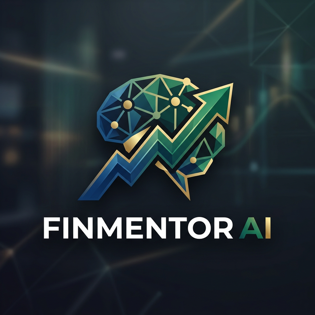

<p align="center">
  
</p>

# FinMentor AI - AI-Powered Finance Education & Investment Intelligence Platform 🚀

**🏆 Winner of FESTONIC 2K26 🏆**

**🌐 Live Demo:** [fin-mentor-ai.vercel.app](https://fin-mentor-ai.vercel.app)

FinMentor AI is a full-stack web platform that integrates financial education with real-time market intelligence and AI-powered advisory. It functions as a unified ecosystem where users can learn, practice, analyze, and receive intelligent guidance within a single environment.

---

## 🎯 The Problem

Despite increased access to financial markets, there remains a massive gap between financial learning and real-world application. Many individuals understand theoretical concepts but struggle to interpret market movements, analyze news impact, or manage portfolios effectively. 

Existing platforms naturally separate learning, trading tools, and advisory systems. There is a distinct lack of an integrated ecosystem that allows users to:
- Learn financial concepts
- Practice market prediction
- Understand the effect of news on markets
- Analyze personal portfolios
- Receive AI-driven strategic guidance

## 💡 The Solution (Our Challenge)

We built **FinMentor AI** to solve this exact problem. It is an integrated ecosystem that functions as a unified web platform bridging financial education with real-time market intelligence and AI-powered advisory all in one seamless environment.

---

## ✨ Core Features

- **AI Financial Advisor**: Get personalized financial advice and interact with an intelligent NLP chatbot for any finance queries.
- **Financial Learning Modules**: Structured educational content designed to seamlessly improve your financial literacy.
- **Stock Prediction Simulator**: Practice market prediction through AI-driven insights and forecasting for various stocks.
- **News & Market Intelligence**: Understand the effect of news on markets with curated, up-to-date financial news and sentiment analysis.
- **Portfolio Analyzer**: Powerful dashboard tools to evaluate, manage, and analyze your personal investment portfolio.
- **Community Forum**: Connect with other users to discuss financial topics, strategies, and market events.
- **Gamification Leaderboard**: Track your learning progress, earn points, and compete with others on the platform.
- **Secure Authentication**: Robust signup and login powered by Supabase auth.

---

## 🛠 Technology Stack

- **Frontend**: React 18, Vite
- **Language**: TypeScript
- **Styling**: Tailwind CSS & shadcn/ui (based on Radix UI)
- **State Management & Data Fetching**: React Query (@tanstack/react-query)
- **Routing**: React Router DOM
- **Backend & Database**: Supabase (PostgreSQL + Edge Functions)
- **Data Visualization**: Recharts
- **Animations**: Framer Motion

---

## 🚀 Getting Started

### Prerequisites
Make sure you have [Node.js](https://nodejs.org/) and npm installed on your machine.

### Installation

1. **Clone the repository:**
   ```bash
   git clone https://github.com/Nihar-Shadow/FinMentor.git
   cd finmentor-ai
   ```

2. **Install the dependencies:**
   ```bash
   npm install
   ```

3. **Start the development server:**
   ```bash
   npm run dev
   ```
   The application will be available at `http://localhost:8080/` (or port specified by Vite).

4. **Production Build:**
   ```bash
   npm run build
   ```
   This will generate the compiled output in the `dist` folder.

---

## 🔑 API Configuration Setup

FinMentor AI requires multiple API keys and environment variables to function properly across frontend and backend edge functions.

### Required Environment Variables

| Environment Variable | Description |
| :--- | :--- |
| `VITE_SUPABASE_URL` | **Database URL**: Your public Supabase project URL for the database and authentication. |
| `VITE_SUPABASE_PUBLISHABLE_KEY` | **Anon Key**: Publicly safe anon key used to interact with your Supabase backend. |
| `MARKET_DATA_API_KEY` | **Market Data API**: Used for fetching simulated/mock datastreams or live historical tick data. |
| `NEWS_API_KEY` | **News API**: Fetches live news articles prior to pushing them to the sentiment engine. |
| `GROQ_API_KEY` | **LLM AI Key**: The proxy API key used inside Supabase Edge functions to orchestrate AI responses. |

### `.env` File Example

Create a `.env` file in the root directory (for the Vite frontend architecture) and load your edge secrets directly into Supabase.

```env
# ====== Frontend Application (.env) ======
VITE_SUPABASE_PROJECT_ID="your_project_id"
VITE_SUPABASE_PUBLISHABLE_KEY="eyJhbGciOiJIUzI1Ni..."
VITE_SUPABASE_URL="https://your_project_id.supabase.co"

# ====== Supabase Edge Functions / Backend (.env) ======
# DO NOT EXPOSE TO FRONTEND
GROQ_API_KEY="sk-groq-..."
MARKET_DATA_API_KEY="sk-market-..."
NEWS_API_KEY="sk-news-..."
```

### Security Details

- **Do not commit API keys:** Ensure your `.env` files are in `.gitignore`.
- **Backend-Only Exposure:** Critical LLM keys (like `GROQ_API_KEY`) MUST only exist on the backend layers (Supabase Edge functions).
- **Restart Local Server:** After updating `.env` keys locally, restart the development server `npm run dev`.

---
*Built with ❤️ for FESTONIC 2K26.*
